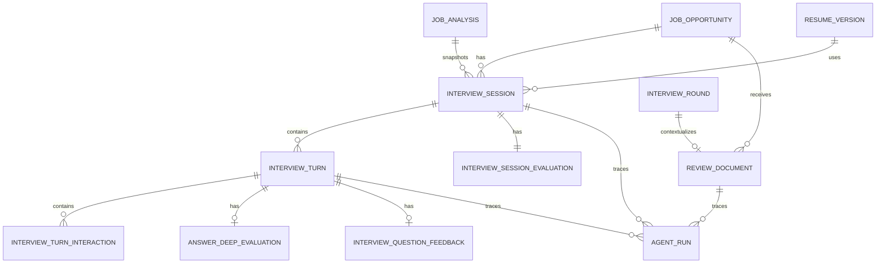

# 模拟面试后端与 Agent 可观测性

## 目标与边界

本文记录模拟面试的领域约束、持久化结构、Agent 执行链路与调试方式。模拟面试蓝图、回答处理、跳过调度、累计总体评估、结束态最终复盘、复盘引用和单题深度点评已经接入真实链路。

已经完成的边界：

- 会话固定绑定创建时的岗位机会、JD 分析、简历版本、模型快照和 Prompt 版本；切换模型必须显式确认。
- 一组问题与最终回答使用一个 `InterviewTurn` 作为唯一定位单位。
- 澄清请求、澄清回复和跑题引导是 Turn 下的 `Interaction`，不消耗问题额度，也不形成评分单元。
- 问题评估计划和回答证据使用 Zod 约束的 JSONB；高频查询、独立生命周期和一对多实体使用独立表。
- 深度点评独立于总体评分，只在用户主动请求时生成。
- API Key 不写入 Session、Turn、AgentRun 或任何调试记录。

已经实现的核心 AI 工作：

- 根据 JD、简历、分析结果和配置生成岗位专属难度规则、面试计划与首题。
- 将回答与当前 Topic 的评估点逐项对照，生成 `AnswerEvidence`。
- 决定追问、进入新主题或结束，并在事务中完成当前 Turn、更新总体评价和创建下一题。
- 跳过问题时根据跳过原因决定是否消耗额度，并生成同主题替代题、下一主题或结束面试。
- 为面试蓝图与回答处理分别创建 `interview_plan`、`interview_turn` AgentRun，记录重试、原始输出、结构化结果、错误、Token 和耗时。
- 模型结构化输出不通过 Zod 时，携带字段路径和值进入有界修复重试。
- 每次有效回答都会更新同一份累计总体评估；面试结束后直接冻结并展示该结果，不再额外调用一个内容高度重复的 Final Summary Agent。
- 面试结束时，回答 Agent 可在同一次 `finish_session` 输出中附带最终复盘；模型只使用 `reviewEvidence` 中的紧凑事实，并通过 `T1`、`T2` 这类题次键引用依据。
- 服务端把题次键映射为真实 `turnId + sequenceNumber` 后再保存；总评分仍由服务端确定性聚合，最终复盘不会反向改写分数。
- 如果最终复盘字段校验失败，系统保留已通过校验的回答证据和评分，并生成最小可审计复盘，不会丢失用户回答。
- 创建新一轮模拟面试时，会读取同一岗位下已结束且证据充分或部分充分的历史模拟面试，聚合最多 5 条可定位到主题的历史薄弱项。
- 创建新一轮模拟面试时，会读取当前岗位已保存的真实笔试复盘和真实面试轮次复盘，压缩为最多 8 条 `historicalReviews` 输入；这些内容只作为补充证据，不会被当成模型评分事实。
- 历史输入不会携带内部 ID、姓名、简历版本 ID 或密钥；没有明确主题归属的自由文本薄弱项不会被强行映射到新主题。
- 真实笔试/面试复盘文本的结构化提取已经完成持久化、异步调度和历史上下文接入：原文保存到 `review_documents`，提取结果、状态、模型快照和失败信息独立维护；机会主表只保存用户原文，不被模型结果改写。
- 基础面中，单条历史复盘只能提高相关主题优先级，不能垄断主题；存在多个独立基础能力类别且主题预算不少于 3 时，该复盘直接驱动的主题最多占预算的一半，除非岗位本身只集中在同一专业领域。
- 本迭代没有新增 `historical_weaknesses` 表；第一版在创建面试时按现有评估快照实时聚合，避免引入重复存储和额外迁移。

尚未实现的核心 AI 工作：

- 真正的 Token 流式传输；当前业务接口采用异步 AgentRun，前端使用任务状态和模拟流式展示改善等待体验。

### 后台任务统一监控与并发

JD 分析和单题深度点评都属于后台 AgentRun，但不需要为每一条任务建立一个前端轮询循环。前端使用 `BackgroundTaskStore` 保存任务引用，按批次请求统一状态接口；前台每 5 秒轮询，页面隐藏时降为 30 秒，恢复可见立即请求一次。

为控制 Supabase Egress，状态链路和详情链路分开：

- `/api/background-tasks/status` 只返回 JD 分析/深度点评的状态摘要；进入完成态后，前端再按任务类型请求一次完整结果。
- `/api/interview-sessions/:sessionId/status` 只返回 `status`、`phase`、`stateVersion`、`currentTurnId`、`updatedAt` 和错误摘要。模拟面试页面在状态版本未变化时不再请求完整 Session，版本变化后才同步会话正文。
- AgentRun 调试列表只读取运行元数据和错误摘要；`input`、`rawOutput`、`parsedOutput` 只由 `/api/developer/agent-runs/:runId` 按需读取。
- 开启 `API_METRICS_ENABLED=true` 可记录接口响应字节、查询次数和关键读路径耗时，便于用真实日志验证 Egress 是否回落。

服务端入队前统计 `pending + processing` 任务，并在当前 API 进程内串行化“检查容量 + 写入任务”临界区：

- JD 分析最多同时执行 5 个；
- 深度点评最多同时执行 5 个；
- 真实复盘提取最多同时执行 5 个文档；
- 三类任务合计最多同时执行 10 个；
- 同一任务重试复用原业务记录，不额外占用一个并发槽位；
- 超出限制返回 `429 background_task_capacity_exceeded`，模型请求本身不持有准入锁。

一次批量状态请求只携带任务引用，不把 API Key、内部 Resume/Version/Run ID 返回给前端。任务完成或失败时，根 Store 将结果同步回机会/面试 Store；用户不在对应页面时才显示右下角 Toast。

## 数据关系



### 为什么不是全部保存成一条 JSON

`configuration`、`assessmentPlan`、`question`、`answerEvidence` 和总体评价快照是有界结构，适合 JSONB。Turn、Interaction、深度点评和反馈具有独立生命周期、唯一约束或分页需求，因此使用独立表。这样既保留对象式结构，也避免每次修改一条回答时重写整场面试。

## 关键一致性规则

- `interview_turns(session_id, sequence_number)` 唯一，保证会话内顺序稳定。
- 每个 Session 同时最多存在一个开放 Turn。
- `answer_submission_key` 唯一，给后续回答提交提供幂等入口。
- 幂等查询必须发生在“是否仍为当前题”的状态校验之前：同一请求即使已经推动 Session 进入下一题，也应返回最新会话快照，不能误报 `409`。
- 同一个提交标识只能属于同一 Session 的同一 Turn；跨 Turn 或跨 Session 复用必须返回冲突。
- 后端接受回答时立即把回答正文写入当前 Turn，再异步调用模型；因此模型最终失败、页面刷新或手动重试都不会丢失用户回答。
- `state_version` 是 Session 乐观锁；状态迁移必须匹配旧版本并递增，防止两个请求覆盖彼此。
- 每个 Turn 最多一条深度点评和一条反馈。
- 轻量点赞/点踩可切换或撤销；提交原因或备注后写入 `lockedAt` 并锁定。
- 两级提示随问题一次生成并保存在 Turn 中，详情 API 返回提示正文；前端用 LocalStorage 保存当前会话已展开级别和首次风险确认，正式提交回答时再把 `hintUsage` 持久化到 Turn。
- 跳过原因持久化在当前 Turn；`unclear`、`irrelevant` 不消耗题目额度并生成同主题替代题，其他原因消耗额度且不得补问同一主题。
- 页面隐藏后详情轮询降为 30 秒，恢复可见时立即同步一次；离开页面会中止未完成请求，迟到响应必须通过 request generation 校验后才能更新状态。
- 用户结束面试时，Session 结束、开放 Turn 变为 `abandoned`、活动 AgentRun 变为 `cancelled` 必须在同一个事务内完成；事务成功后再通过 `operationKey` 中止实际模型请求。
- 第一版采用历史保留策略：存在模拟面试历史时，直接删除对应机会或简历会返回 `409`，而不是级联删除或暴露数据库 `500`。归档与显式级联删除方案留待产品确认。

## AgentRun 通用化

`agent_runs` 从只服务 JD 分析扩展为通用 Agent 执行记录：

- `workflowType` 区分 JD 分析、面试计划、单轮决策、深度点评和最终总结。
- `operationKey + attemptNumber` 形成通用重试唯一约束。
- `analysisId` 改为可空，同时新增 `interviewSessionId` 和 `interviewTurnId`。
- 历史 JD Run 在迁移中回填为 `workflowType = job_analysis`，`operationKey = job_analysis:{analysisId}`。

现有 JD 分析的创建、重试和调试接口仍然使用原来的 `analysisId`，没有改变用户行为。

### AgentRun 调试台

模拟面试与 JD 分析共用一张 `agent_runs` 表，但通过不同关联字段定位业务上下文：

| 工作流           | `workflowType`              | 业务关联                               |
| ---------------- | --------------------------- | -------------------------------------- |
| JD 匹配分析      | `job_analysis`              | `analysisId`                           |
| 面试蓝图与首题   | `interview_plan`            | `interviewSessionId`                   |
| 回答评估与下一题 | `interview_turn`            | `interviewSessionId + interviewTurnId` |
| 单题深度点评     | `interview_deep_evaluation` | `interviewSessionId + interviewTurnId` |
| 整场复盘         | `interview_final_summary`   | 保留枚举，第一版不执行独立工作流       |
| 真实复盘文本提取 | `review_extraction`         | `reviewDocumentId`                     |

开发者调试查询必须以 `agent_runs` 为主表，并使用 `LEFT JOIN` 补齐 Analysis、Session、Turn 和 Opportunity 信息。不能从 `job_analyses` 使用 `INNER JOIN` 反查，否则 `analysisId = null` 的模拟面试记录会被数据库直接过滤。

调试台支持按工作流筛选，并展示：

- 当前工作流、关联公司与岗位；
- Session ID、Turn ID 和题目序号；
- pending、processing、completed、failed、cancelled 状态；
- Prompt 版本、模型名、尝试次数、耗时和 Token；
- 发送给模型的受控业务输入、原始输出、Zod 校验后的结构化结果与错误。

列表与当前选中详情每 3 秒刷新一次。运行状态发生变化时自动重新读取详情；快速切换筛选或记录时使用请求序号丢弃过期响应，避免旧请求覆盖新页面状态。调试台不会展示模型私有思维链，也不会记录或返回 API Key。

### 真实复盘文本提取的持久化边界

`review_documents` 是一份真实复盘原文的稳定业务记录：

- `sourceType = written_test` 时，文档属于某条机会，`interviewRoundId` 必须为空；同一机会最多一份当前笔试复盘文档。
- `sourceType = interview` 时，文档属于某一轮真实面试，`interviewRoundId` 必须存在；同一轮最多一份当前文档。
- 已有复盘文档的面试轮次暂不允许直接删除（外键使用 `restrict`），必须先明确删除或迁移复盘文档，避免用户的原始复盘被静默删除。
- `rawText` 永远保留用户提交的原文；`result` 只保存通过 Zod、原文引用校验和 offset 计算后的合并证据。
- `status` 与 `currentAttempt` 记录异步提取生命周期；失败时保留原文和可审计错误，重试不会丢失用户输入。
- 每个 chunk 的模型调用通过 `agent_runs.review_document_id` 关联到文档，工作流类型为 `review_extraction`。重叠 chunk 的重复证据在服务端按 `kind + sourceStartOffset + sourceEndOffset` 去重。
- 提取解析层会兼容模型偶尔返回的顶层数组和 `answerStatus = answered` 等价别名，但归一化后仍必须通过 Zod、原文引用和 offset 校验；输出上限与修复 Prompt 同时约束，避免长 JSON 被截断。

保存笔试复盘时，机会服务会先完成原文保存，再将明确的 `reviewNote` 异步入队提取；模型配置缺失时仍保留原文，不阻塞保存。面试轮次接口同样支持显式传入 `reviewNote + modelConnection`，但不会把通用 `note` 自动当作复盘文本外发，避免误把普通备注发送给模型。创建下一轮模拟面试时，优先使用已完成的结构化提取结果；提取中或失败时回退到原文摘要。

机会详情可以通过复盘文档接口读取当前状态。失败文档只能使用当前配置重新执行，重试会递增 `revision`，旧的失败 AgentRun 仍保留在调试台中；接口返回只包含状态、错误摘要和结构化结果，不返回原始长文本。

## 最终复盘与引用

最终复盘不是新的前端轮询任务，也不是一条独立的重复 AgentRun。最后一次回答的 `interview_turn` AgentRun 在 `nextAction.type = finish_session` 时可以同时返回：

- `summary`：本轮总体结论；
- `strengths`：最多 3 条优势，每条带 1～3 个 `referenceKeys`；
- `gaps`：最多 3 条短板，每条带优先级和 1～3 个 `referenceKeys`；
- `nextPractice`：最多 3 条练习建议。

`referenceKeys` 只在模型输入中使用短题次键（例如 `T4`），避免把数据库 ID 暴露给模型。服务端会校验键是否存在，并在落库前转换成真实 `turnId`。前端复盘面板显示题次引用按钮，点击后滚动到对应问答并短暂高亮；旧记录没有引用数据时不伪造题号。

最终复盘会使最后一次模型响应的 Prompt 和输出略微变大，因此耗时可能比普通回答稍长，但没有新增一次模型调用。若最终复盘结构错误，只降级复盘本身，不影响回答保存、下一题决策或累计评分。

## 当前 API

| 方法     | 路径                                                                   | 作用                                               |
| -------- | ---------------------------------------------------------------------- | -------------------------------------------------- |
| `POST`   | `/api/opportunities/:opportunityId/interview-sessions`                 | 创建 preparing 会话与初始评价快照                  |
| `GET`    | `/api/opportunities/:opportunityId/review-documents`                   | 获取笔试/真实面试复盘提取状态与结构化结果          |
| `POST`   | `/api/opportunities/:opportunityId/review-documents/:documentId/retry` | 重试失败的复盘提取任务                             |
| `POST`   | `/api/opportunities/:opportunityId/interview-rounds/:roundId/complete` | 将待进行安排原子地标记为已完成                     |
| `POST`   | `/api/opportunities/:opportunityId/interview-rounds/:roundId/cancel`   | 将待进行安排原子地标记为已取消                     |
| `GET`    | `/api/interview-sessions?opportunityId=...`                            | 获取某机会的历史会话                               |
| `GET`    | `/api/interview-sessions/active-model-usage`                           | 检查当前用户未完成面试使用的模型快照               |
| `GET`    | `/api/interview-sessions/:sessionId`                                   | 获取会话、Turn、Interaction、问题提示、评分与反馈  |
| `PATCH`  | `/api/interview-sessions/:sessionId/model`                             | 在安全状态显式切换本轮后续任务使用的模型           |
| `POST`   | `/api/interview-sessions/:sessionId/end`                               | 结束进行中或准备中的会话                           |
| `POST`   | `/api/interview-sessions/:sessionId/turns/:turnId/answers`             | 接受回答并异步执行回答评估与下一题生成             |
| `POST`   | `/api/interview-sessions/:sessionId/turns/:turnId/retry-answer`        | 对最终失败的当前回答开启新一组有界重试             |
| `POST`   | `/api/interview-sessions/:sessionId/turns/:turnId/cancel-answer`       | 中止模型任务并把当前 Turn 恢复为待回答状态         |
| `POST`   | `/api/interview-sessions/:sessionId/turns/:turnId/skip`                | 持久化跳过原因并异步调度替代题、下一主题或结束     |
| `POST`   | `/api/interview-sessions/:sessionId/turns/:turnId/retry-skip`          | 重试最终失败的跳过调度任务                         |
| `PUT`    | `/api/interview-sessions/:sessionId/turns/:turnId/feedback`            | 新增或更新反馈                                     |
| `DELETE` | `/api/interview-sessions/:sessionId/turns/:turnId/feedback`            | 撤销未锁定的轻反馈                                 |
| `POST`   | `/api/interview-sessions/:sessionId/turns/:turnId/deep-evaluation`     | 创建、续接或重试单回答深度点评                     |
| `GET`    | `/api/interview-sessions/:sessionId/turns/:turnId/deep-evaluation`     | 获取深度点评状态与已完成结果                       |
| `GET`    | `/api/interview-sessions/:sessionId/status`                            | 获取模拟面试轻量状态，版本变化后再读取完整 Session |
| `GET`    | `/api/developer/agent-runs`                                            | 获取全部或指定工作流的 AgentRun 调试列表           |
| `GET`    | `/api/developer/agent-runs/:runId`                                     | 获取业务输入、原始输出和结构化结果                 |
| `POST`   | `/api/background-tasks/status`                                         | 批量获取 JD 分析与深度点评任务状态                 |

创建 Session 只代表持久化上下文已经建立。后续 Agent 服务生成面试计划和首题后，才会在一个事务中把 Session 从 `preparing` 切到 `active`。

## 回答处理状态机与恢复策略

```text
awaiting_answer
  → processing（回答已持久化，AgentRun 执行中）
    → completed（保存证据并创建下一题或结束面试）
    → processing_failed（三次尝试均失败，保留原回答）
      → processing（用户点击重试，开启新的三次尝试）
    → awaiting_answer（用户主动中止，清除已接受回答并恢复编辑）
```

- 浏览器 `AbortController` 只负责停止等待 HTTP 响应，不能代表业务任务已经取消；业务中止必须调用 `cancel-answer`。
- 模型客户端以 `operationKey` 管理活动请求。用户中止与超时分别映射为 `cancelled` 和 `timeout`，取消不会触发自动重试。
- 中止与模型完成可能并发发生：Repository 使用 Turn 状态和 Session `stateVersion` 决定唯一胜者；如果模型已经完成，中止返回冲突，前端以最新服务端状态为准。
- 前端轮询只依据服务端 Session/Turn 阶段；`processing_failed` 会停止轮询并展示重试入口，不能由本地乐观回答覆盖。
- 同一 `clientSubmissionId` 因超时、刷新或响应丢失被再次提交时，后端返回当前最新 Session，不会再次创建 AgentRun 或下一题。

跳过问题复用 Turn 的开放状态约束：

```text
awaiting_answer
  → processing（skip 已持久化，生成替代题或下一题）
    → skipped + next awaiting_answer
    → skipped + session completed
    → processing_failed（三次尝试均失败）
      → processing（用户点击重试）
```

回答与跳过都通过 Session `stateVersion`、Turn 状态条件和 AgentRun 唯一键防止重复提交或迟到任务覆盖新状态。

## 单回答深度点评

深度点评独立于整场总体评分，只允许对已经形成 `answerEvidence` 的正式回答生成。每个 Turn 在
`answer_deep_evaluations` 中最多保留一条记录：

```text
不存在
  → processing（三次以内的 AgentRun 自动尝试）
    → completed（缓存成功结果，不重复生成）
    → failed（恢复生成入口；再次点击开启新一组尝试）
```

- `POST deep-evaluation` 对 completed、pending、processing 直接返回现有记录，防止快速重复点击创建任务。
- 失败后重新点击会复用同一条业务记录，并递增 AgentRun `attemptNumber`。
- Session 详情只返回每个 Turn 的深度点评状态；完整点评由独立 `GET` 接口按需加载，避免所有历史点评撑大详情响应。
- Prompt 只接收岗位角色、当前主题、本题目标评估点、当前问答、已展示提示，以及最多两条同根追问摘要；数据库 ID、API Key、完整简历和整场历史不进入模型输入。
- AI 负责逐评估点语义判断、原文证据和改进建议；后端负责目标点集合、权重归一化、提示折损、总分和等级。
- `masteryScore` 由逐点评分加权计算，表达能力只调节 5%；一级提示计入系数为 `0.75`，二级提示为 `0.5`。
- `evidenceExcerpt` 必须是当前回答中的原文。回答优化必须保留原回答事实和结构；缺少真实经历时使用占位符，不能编造。

### 核心竞态处理矩阵

| 场景                                   | 唯一事实来源                                            | 处理规则                                     |
| -------------------------------------- | ------------------------------------------------------- | -------------------------------------------- |
| 回答接口成功，但客户端没收到响应并重发 | `answer_submission_key` / Interaction `clientMessageId` | 识别为同一次操作并返回最新 Session           |
| 用户中止时旧轮询先返回                 | Session request generation                              | 丢弃旧响应，取消接口完成后强制同步服务端状态 |
| 用户中止与模型完成同时发生             | Turn 条件更新 + Session `stateVersion`                  | 数据库只允许一个事务获胜，另一方读取最新状态 |
| 用户结束整场面试时模型仍在运行         | Session、Turn、AgentRun 同一事务                        | 持久化为结束/废弃/取消，再中止网络模型请求   |
| 页面在回答处理中刷新                   | 服务端 Turn + AgentRun 输入恢复                         | 继续展示已接受回答并轮询，不把正文退回输入框 |
| 页面切到后台                           | `document.visibilityState`                              | 轮询降为 30 秒；恢复可见立即同步一次         |
| 切换模型时当前任务仍在运行             | Session/Turn 状态                                       | 拒绝切换；只允许待回答或最终失败状态显式切换 |

## 问题复杂度预算

单题是默认形式。只有多个子问题共同服务于一个评估目标、需要结合判断且适合一次回答时，才能使用复合题。

| 训练规模 | 总问题预算 | 复合题上限 |
| -------- | ---------- | ---------- |
| 快速     | 5          | 1          |
| 标准     | 9          | 2          |
| 深度     | 14         | 3          |

复合题上限不是生成目标。后端把已使用数量与剩余额度作为 Turn Agent 输入，并通过上下文 Zod 校验拒绝超额输出。每道复合题只能包含 2～3 个子问题，引导语与全部子问题合计不超过 240 个字符；可独立评估的概念、流程、指标和优化方案应拆成后续单题。

## 评分约束

第一版最终分数采用：

```text
overall = masteryScore × (0.95 + 0.05 × communicationScore / 100)
```

岗位能力决定主体分数，表达能力只做最多 5% 的调节；表达优秀不能掩盖知识错误。评分单位是 Topic（主问题及其追问合并评价），Combo 第一版不直接加减总分。

## 自动化回归边界

当前核心测试至少覆盖：

- 页面前后台轮询频率和 request generation 迟到响应拦截；
- 模型身份归一化比较；
- 回答与跳过 Prompt 的题目预算、复合题和跨字段约束；
- 同一提交标识的幂等重放和跨 Turn 冲突；
- 结束面试时需要取消的蓝图、跳过和回答三类 operation key。
- 模型额度、鉴权、限流与无效配置的错误分类，避免把不可重试错误继续自动重传。

回答评估 Prompt 当前版本为 `mock-interview-turn.v6`。AgentRun 保存完整输入用于审计，实际发送给模型时会删除可由 `reviewEvidence` 等字段完整还原的重复上下文；运行时契约会明确本次允许的动作、主题和题目额度。离线 benchmark 从脱敏 AgentRun 构建多场景案例，以低 temperature、多次采样比较结构通过率、业务约束通过率、决策分布、Token 和耗时，不能用单次模型成功代表 Prompt 已稳定。

数据库事务与真实模型中止仍需人工联调验证，不能用纯单元测试替代。

## 下一步：继续验证面试质量

1. 继续通过调试台观察蓝图偏题、回答证据失真、追问决策和结构化修复重试。
2. 模型工作流需要用户重点参与 Prompt、评估标准和失败策略；Repository CRUD 继续由通用模式实现。
